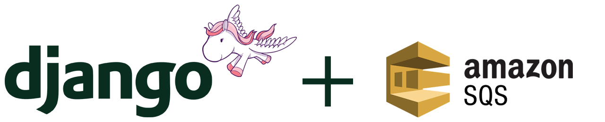

# 

This codebase was created to demonstrate a fully fledged fullstack application built with Django including some CRUD operations, authentication, routing, sending messages to AWS SQS, processing AWS SQS queues, generating a PDF and sending email using Postmarkapp service.

# How it works

Starting the Django server will bring up the Order a Pizza site.

# Getting started

You need to have [virtualenv](https://virtualenv.pypa.io/) and Python 3.7 installed on your machine. Now run:

    $ make
    $ make collectstatic
    $ make migrate
    $ make load
    $ make run

Or the traditional way:

    $ virtualenv -p python3.7 venv
    $ source venv/bin/activate
    (venv) $ pip install -r requirements.txt
    mkdir djangosqs_media/receipt
    mkdir djangosqs_media/uploads
    rsync -rupE djangosqs/static/images/ djangosqs_media/uploads/
    (venv) $ python manage.py collectstatic --noinput
    (venv) $ python manage.py migrate
    (venv) $ python manage.py loaddata orderapizza.json
    (venv) $ python manage.py runserver

Now point your browser to:

- http://localhost:8000/ -> DjangoSQS frontend app
